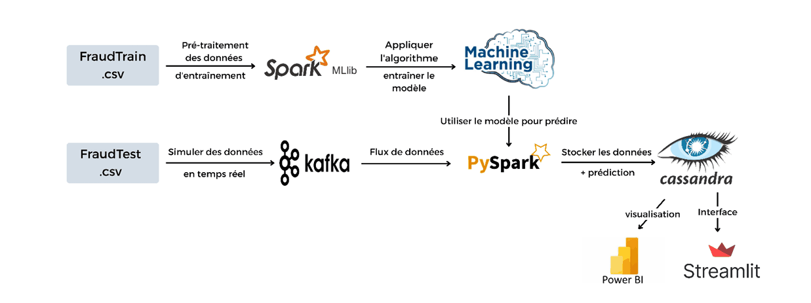
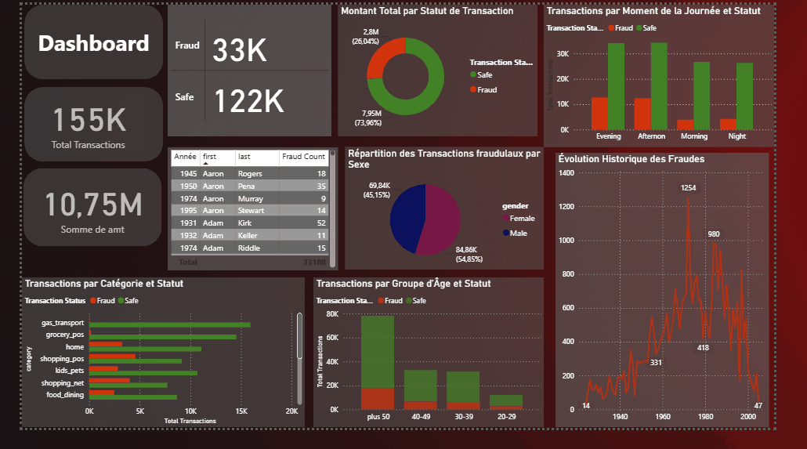
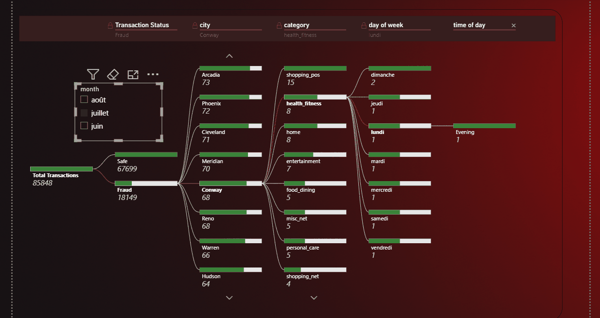
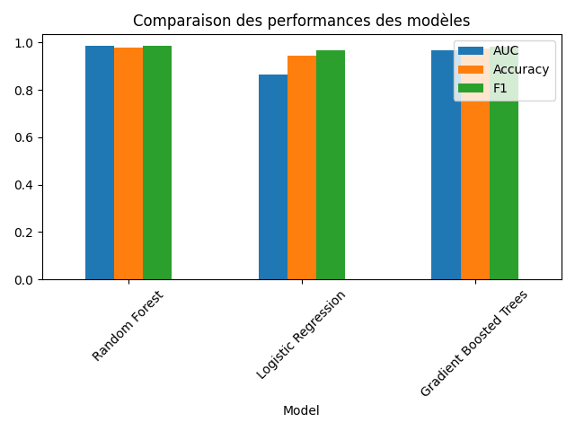

# Streaming Fraud Detection

**Real-time credit-card fraud detection** built with **Kafka**, **Apache Spark (Structured Streaming + MLlib)**, **Apache Cassandra**, **Streamlit** and **Power BI**.

Transactions are simulated from a historical dataset, pushed into a Kafka topic, scored in streaming by
pre-trained MLlib models, persisted into Cassandra and visualised in real time.

> Source code: [`Streaming-Fraud-Detection/`](Streaming-Fraud-Detection/)

---

## Table of contents

- [1. Architecture & project flow](#1-architecture--project-flow)
  - [1.1 How it works](#11-how-it-works)
- [2. Demo](#2-demo)
  - [2.1 Streamlit — live application](#21-streamlit--live-application)
  - [2.2 Power BI — Executive dashboard](#22-power-bi--executive-dashboard)
  - [2.3 Power BI — Interactive drill-down](#23-power-bi--interactive-drill-down)
- [3. Repository layout](#3-repository-layout)
- [4. Tech stack](#4-tech-stack)
- [5. Getting started](#5-getting-started)
  - [5.1 Prerequisites](#51-prerequisites)
  - [5.2 Configure the environment](#52-configure-the-environment)
  - [5.3 Start the infrastructure](#53-start-the-infrastructure)
  - [5.4 Train the models (optional)](#54-train-the-models-optional)
  - [5.5 Run the streaming scoring job](#55-run-the-streaming-scoring-job)
  - [5.6 Run the Streamlit dashboard locally](#56-run-the-streamlit-dashboard-locally-alternative-to-docker)
  - [5.7 Open the Power BI report](#57-open-the-power-bi-report)
- [6. Configuration reference (`.env`)](#6-configuration-reference-env)
- [7. Model results](#7-model-results)
- [8. Outputs](#8-outputs)
- [9. Authors](#9-authors)

---

## 1. Architecture & project flow




### 1.1 How it works

**Offline:** `fraudTrain.csv` is cleaned and featurised with **PySpark**, then three **MLlib** classifiers
(RandomForest, LogisticRegression, GBT) are trained, evaluated and saved as `PipelineModel`s.

**Real-time:** `fraudTest.csv` is replayed transaction by transaction → **Kafka producer** (1–10 transactions
every 3 s) → **Kafka topic `transaction_data`** → **Spark Structured Streaming** (clean → load the
`PipelineModel` → predict → alert) → **Cassandra** (`transactions_pred`, `alerts`) →
**Streamlit** dashboard + **Power BI** report, with optional SMTP e-mail alerts.

---

## 2. Demo

### 2.1 Streamlit — live application

<video src="Streaming-Fraud-Detection/demo/streamlit-demo.mp4" controls width="100%"></video>

[▶ Watch the Streamlit demo](Streaming-Fraud-Detection/demo/streamlit-demo.mp4)

Three pages: **Overview** (KPIs, time series, live transaction feed), **Transaction Analysis**
(search + drill-down per transaction) and **Detailed Statistics** (fraud rate, distributions, alerts, CSV export).

### 2.2 Power BI — Executive dashboard



*Global KPIs: total / fraudulent transactions, amount by transaction status, fraud per category, per age group,
per time of day and the historical fraud trend.*

### 2.3 Power BI — Interactive drill-down



*Interactive decomposition tree: **Transaction Status → City → Category → Day of week → Time of day**,
with slicers on month and instant cross-filtering on every visual.*

---

## 3. Repository layout

```
.
├── .env.example                 # every environment variable, documented
├── .gitignore                   # secrets, datasets, trained models, Spark output
├── config.py                    # single configuration loader (env → .env → defaults)
├── cassandra_init.cql           # keyspace + tables bootstrap
├── Rapport_Projet_BIG_DATA.pdf  # project report
│
└── Streaming-Fraud-Detection/
    ├── app/
    │   ├── streamlit_app.py     # live dashboard (Streamlit)
    │   ├── Powerbi_dashboard.pbix
    │   ├── Dockerfile
    │   └── requirements.txt
    ├── data/raw/                # fraudTrain.csv, fraudTest.csv (git-ignored)
    ├── demo/                    # screenshots + Streamlit demo video
    ├── infra/
    │   ├── docker-compose.yml   # zookeeper, kafka, producer, spark, cassandra, streamlit
    │   └── requirements.txt
    ├── notebooks/
    │   ├── DataClearning_and_EDA.py
    │   └── train_model.py       # trains RF / LR / GBT with MLlib
    ├── resultats/
    │   ├── EDA/                 # text report + visualisations
    │   └── models/              # trained PipelineModels (git-ignored)
    └── src/
        ├── kafka/               # Dockerfile + kafka_producer.py
        └── spark/               # spark_streaming.py, spark_streaming_predict.py
```

---

## 4. Tech stack

| Layer       | Technology |
|-------------|------------|
| Messaging   | Apache Kafka (+ Zookeeper, `wurstmeister` images) |
| Processing  | Apache Spark — Structured Streaming, MLlib |
| Storage     | Apache Cassandra 4.0 |
| ML          | RandomForest, Logistic Regression, Gradient-Boosted Trees (class-weighted) |
| Dashboard   | Streamlit, Plotly |
| BI          | Microsoft Power BI (`.pbix`) |
| Packaging   | Docker / Docker Compose |
| Language    | Python 3.9+ |

---

## 5. Getting started

### 5.1 Prerequisites

* Docker + Docker Compose
* Python 3.9+ (for the jobs you run outside Docker)
* Java 11 (for local Spark) — *or simply use the Spark containers*

### 5.2 Configure the environment

All hosts, paths, credentials and model locations live in **one** file:

```bash
cd Streaming-Fraud-Detection
cp .env.example .env      # then edit .env
```

Nothing is hard-coded in the scripts any more — `config.py` reads the real environment first,
then `.env`, then the built-in defaults.

### 5.3 Start the infrastructure

```bash
docker compose -f infra/docker-compose.yml up -d
```
This starts **Zookeeper → Kafka → Kafka producer (transaction simulator) → Spark master/workers →
Cassandra (+ automatic keyspace creation)** and the **Streamlit** container on `http://localhost:8501`.

> The commands in §5.4 - §5.7 are run from the **repository root** (the folder that contains `Streaming-Fraud-Detection/`).

### 5.4 Train the models (optional)

Pre-trained models are **not** committed (`.gitignore` → `resultats/models/*_model/`). Retrain them:

```bash
python Streaming-Fraud-Detection/notebooks/train_model.py
```

Models are written to `resultats/models/{RandomForest,LogisticRegression,GBTClassifier}_model`.

### 5.5 Run the streaming scoring job

```bash
python Streaming-Fraud-Detection/src/spark/spark_streaming_predict.py
```

### 5.6 Run the Streamlit dashboard locally (alternative to Docker)

```bash
pip install -r Streaming-Fraud-Detection/infra/requirements.txt
streamlit run Streaming-Fraud-Detection/app/streamlit_app.py
```

### 5.7 Open the Power BI report

Open `Streaming-Fraud-Detection/app/Powerbi_dashboard.pbix` with Power BI Desktop and refresh
(connected to the exported / Cassandra-backed dataset).

---

## 6. Configuration reference (`.env`)

| Variable | Default | Description |
|----------|---------|-------------|
| `KAFKA_BOOTSTRAP_SERVERS` | `kafka:9092` | Broker used by the producer **inside** Docker |
| `KAFKA_EXTERNAL_BOOTSTRAP_SERVERS` | `localhost:29092` | Broker used by Spark / host clients |
| `KAFKA_TOPIC` | `transaction_data` | Topic name |
| `KAFKA_SEND_INTERVAL_SECONDS` | `3` | Delay between produced batches |
| `TRAIN_CSV` / `TEST_CSV` | `data/raw/*.csv` | Dataset locations |
| `MODELS_DIR` | `resultats/models` | Root folder of the trained models |
| `MODELS_TO_APPLY` | `GBT` | Comma list: `GBT,RF,LR` |
| `CASSANDRA_HOSTS` / `CASSANDRA_PORT` | `127.0.0.1` / `9042` | Cassandra contact point |
| `CASSANDRA_KEYSPACE` | `fraud_detection` | Keyspace |
| `SPARK_EXECUTOR_MEMORY` / `SPARK_DRIVER_MEMORY` | `4g` / `2g` | Spark memory |
| `SPARK_CHECKPOINT_DIR` | `/tmp/spark_checkpoint` | Streaming checkpoint |
| `SMTP_ENABLED` | `false` | Activate fraud e-mail alerts |
| `SMTP_USER` / `SMTP_PASSWORD` / `ALERT_TO` | – | Gmail account + **app password** + recipient |

---

## 7. Model results

Held-out test set (80/20 split, class-weighted training):

| Model | AUC | Accuracy | F1 |
|-------|-----|----------|----|
| Random Forest | 0.9871 | 0.9793 | 0.9857 |
| Gradient Boosted Trees | 0.9689 | 0.9759 | 0.9837 |
| Logistic Regression | 0.8642 | 0.9463 | 0.9674 |



Additional EDA charts live in
[`Streaming-Fraud-Detection/resultats/EDA/visualisation/`](Streaming-Fraud-Detection/resultats/EDA/visualisation/)
(fraud pie chart, age / gender / month / day-of-week / time-of-day distributions).

---

## 8. Outputs

* **Cassandra** — `fraud_detection.transactions_pred` (prediction + model per transaction) and
  `fraud_detection.alerts` (`HIGH_VALUE_FRAUD` / `SUSPECTED_FRAUD`, risk score, status).
* **Streamlit** — KPIs, time series, fraud distributions, alert list, CSV export.
* **Power BI** — executive dashboard and interactive decomposition tree (see §2.2, §2.3).
* **E-mail** — optional SMTP alert for every fraudulent transaction (`SMTP_ENABLED=true`).

---

## 9. Authors

Made by **Aya Chakour**, **Nabila Chaou** and **Karima Chakkour** — students at **ENSA Tétouan**.
